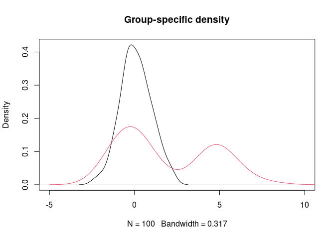
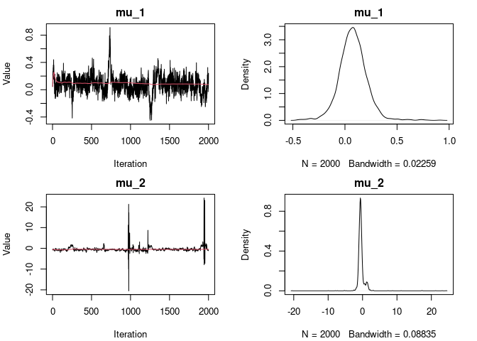
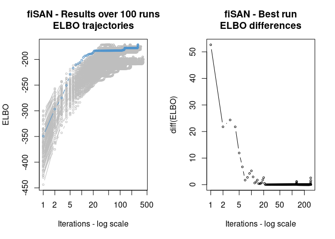

<!-- README.md is generated from README.Rmd. Please edit that file -->

# sanba v0.0.1

<!-- badges: start -->

[](https://github.com/Fradenti/sanba/actions/workflows/R-CMD-check.yaml)
[](https://github.com/fradenti/sanba)
<!---
[](https://cran.r-project.org/package=sanba)
[](https://www.r-pkg.org/pkg/sanba)
[](https://www.r-pkg.org/pkg/sanba)--->
<!-- badges: end -->

The goal of `sanba` is to estimate Bayesian nested mixture models via
MCMC and VI methods. Specifically, the package implements the common
atoms model (Denti et al., 2023) and hybrid finite-infinite models
(D’Angelo and Denti, 2024). All models use Gaussian mixtures with a
normal-inverse-gamma prior distribution on the parameters. Additional
functions are provided to help analyzing the results of the fitting
procedure.

## Installation

You can install the development version of `sanba` from
[GitHub](https://github.com/) with:

``` r
# install.packages("devtools")
devtools::install_github("Fradenti/sanba")
```

## Examples

### Fitting via MCMC

``` r
library(sanba)
#> Loading required package: scales
#> Loading required package: RColorBrewer
set.seed(123)
y <- c(rnorm(160), rnorm(40, 5))
g <- rep(1:2, rep(100, 2))
plot(density(y[g==1]), xlim = c(-5,10), main = "Group-specific density")
lines(density(y[g==2]), col = 2)
```



``` r

out_mcmc <- fit_CAM(y = y, group = g, est_method = "MCMC", mcmc_param = list(nrep = 5000, burn=3000))
#> Warning in sample_CAM(y, group, prior_param = prior_param, mcmc_param =
#> mcmc_param): Increase maxK: all the provided distributional mixture components
#> were used. Check '$warnings' to see when it happened.
out_mcmc
#> 
#> MCMC result of CAM model 
#> -----------------------------------------------
#> Model estimated on 200 total observations and 2 groups 
#> Size of the MCMC sample (after burn-in): 2000 
#> Total MCMC iterations performed: 5000 
#> maxL: 50 - maxK: 20 
#> Elapsed time: 0.615 secs
plot(out_mcmc)
```



    #> [1] "Output truncated at 2 for mu."

### Fitting via VI

``` r
library(sanba)
set.seed(123)
y <- c(rnorm(160), rnorm(40, 5))
g <- rep(1:2, rep(100, 2))
plot(density(y[g==1]), xlim = c(-5,10), main = "Group-specific density")
lines(density(y[g==2]), col = 2)
```


``` r

out_vi <- fit_fiSAN(y, group = g, est_method = "VI", vi_param = list(n_runs = 100))
out_vi
#> Variational inference results for fiSAN 
#> ----------------------------------------------
#> L: 30 - K: 20 
#> Threshold: 1e-06 
#> ELBO value: -173.141 
#> Best run out of 100 
#> Convergence reached in 180 iterations
#> Elapsed time: 0.041 secs
plot(out_vi)
```



# References

D’Angelo, L., and Denti, F. (2024). A Finite-Infinite Shared Atoms
Nested Model for the Bayesian Analysis of Large Grouped Data Sets.
*Bayesian Analysis*

Denti, F., Camerlenghi, F., Guindani, M., Mira, A., 2023. A Common Atoms
Model for the Bayesian Nonparametric Analysis of Nested Data. *Journal
of the American Statistical Association*. 118(541), 405–416.
